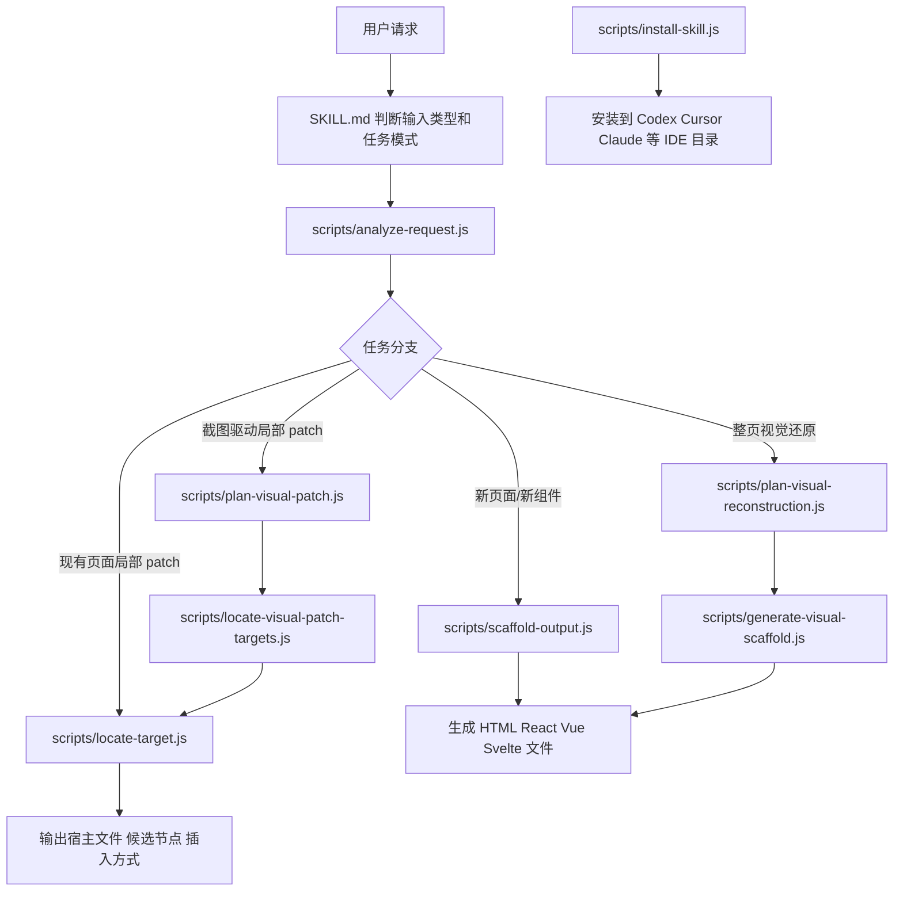
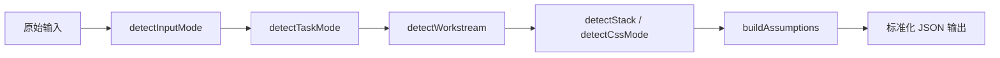
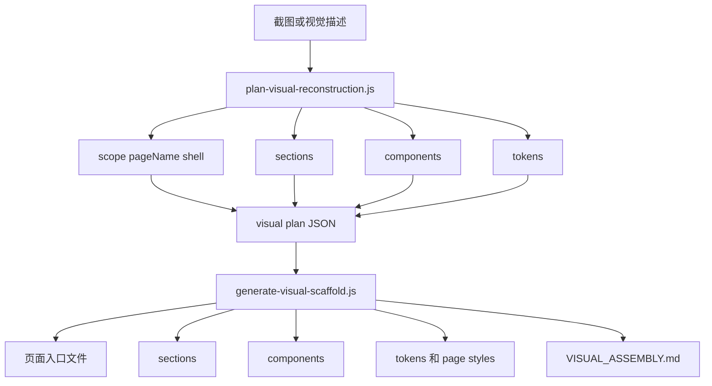
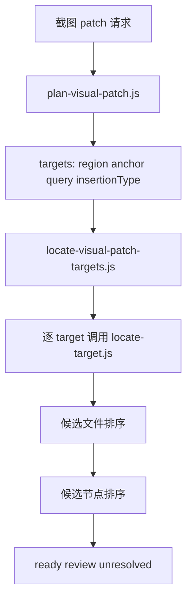

# frontend-ui-builder

这份 README 同时面向两类读者：

- 使用者：看怎么安装、怎么调用这个 skill。
- 维护者：看这个 skill 的实现流程、脚本分工和目录结构。

## 先说结论

`frontend-ui-builder` 不是用 `/create-skill` 临时生成出来的，而是一套已经成型的本地 skill 工具链。它的核心目标是把 UI 请求转成可落地的前端代码或最小 patch。

它主要解决 4 类任务：

1. 根据一句话生成页面或组件 UI。
2. 根据偏 UI 的 PRD 提炼前端结构。
3. 根据截图或视觉描述做高保真页面重建。
4. 根据截图描述，在现有项目里定位宿主文件并做局部 patch。

它擅长：

- 页面结构
- 组件树拆分
- 高保真 UI 还原
- 响应式布局
- 样式对齐
- 在现有前端项目里做最小 patch
- 根据截图定位并修改本地代码

它不该作为主 skill 处理：

- API 编排
- 权限系统
- 数据建模
- 审批流
- 复杂表单提交流程
- 复杂状态机或领域规则

如果一份 PRD 同时包含 UI 和业务逻辑，推荐先实现 UI slice，再把业务部分拆出来单独处理。

## 仓库结构

```text
frontend-ui-builder/
├─ agents/
├─ assets/
│  ├─ fixtures/
│  └─ templates/
├─ references/
├─ scripts/
├─ .gitignore
├─ package-lock.json
├─ package.json
├─ README.md
└─ SKILL.md
```

可以把仓库理解成 5 层：

- `SKILL.md`：skill 的行为规范和主工作流。
- `scripts/`：分析、规划、定位、生成、安装的脚本工具链。
- `references/`：规则、契约和流程文档。
- `assets/templates/`：各技术栈的模板底座。
- `assets/fixtures/`：截图 patch 流程的验证样例。

## 实现总流程



## 三条核心链路

### 1. 请求分析链路

入口脚本：`scripts/analyze-request.js`

职责：

- 判断输入是 `brief`、`document` 还是 `visual`
- 判断任务是 `create-page`、`create-component`、`patch-existing` 还是 `visual-patch-existing`
- 推断 `stack`、`cssMode`、`fidelity`
- 判断请求更偏 `ui`、`business` 还是 `mixed`



### 2. 整页视觉重建链路

入口脚本：

- `scripts/plan-visual-reconstruction.js`
- `scripts/generate-visual-scaffold.js`

流程：

1. 先把截图或视觉描述拆成页面壳、区块、复用组件和 token。
2. 生成一份结构化 `plan JSON`。
3. 再根据目标技术栈生成页面、section、component、token 和 assembly guide。



### 3. 截图驱动局部 patch 链路

入口脚本：

- `scripts/plan-visual-patch.js`
- `scripts/locate-visual-patch-targets.js`
- `scripts/locate-target.js`

流程：

1. 把“图里这个地方改一下”转成语义化 target。
2. 提取区域、锚点、相对关系、插入方式和样式提示。
3. 扫描仓库，输出最可能的宿主文件和节点路径。



## 文件职责和位置

### 根目录

| 文件位置 | 作用 |
| --- | --- |
| `SKILL.md` | skill 主说明，定义适用场景、边界、执行规则和推荐工作流。 |
| `README.md` | 安装、使用和实现说明总入口。 |
| `package.json` | 项目元信息和脚本入口，包含验证命令与安装命令。 |
| `package-lock.json` | npm 依赖锁文件。 |
| `.gitignore` | 忽略临时输出目录和视觉验证产物。 |

### agents

| 文件位置 | 作用 |
| --- | --- |
| `agents/openai.yaml` | skill 的展示配置，定义显示名、简短描述、默认提示词和隐式调用策略。 |

### scripts

| 文件位置 | 作用 |
| --- | --- |
| `scripts/analyze-request.js` | 请求分类器，把原始输入标准化成结构化 JSON。 |
| `scripts/scaffold-output.js` | 通用脚手架生成器，按 `stack + cssMode` 从模板生成基础文件。 |
| `scripts/plan-visual-reconstruction.js` | 视觉重建规划器，把整页截图或视觉描述拆成 `shell / sections / components / tokens / assemblySteps`。 |
| `scripts/generate-visual-scaffold.js` | 视觉脚手架生成器，读取视觉 plan JSON，生成页面、区块、组件、token、样式和 `VISUAL_ASSEMBLY.md`。 |
| `scripts/plan-visual-patch.js` | 截图 patch 规划器，把自然语言局部改动请求拆成多个语义 target。 |
| `scripts/locate-target.js` | 仓库定位器，扫描 HTML / React / Vue / Svelte 文件并给出候选宿主文件和节点。 |
| `scripts/locate-visual-patch-targets.js` | 截图 patch 总调度器，内部串联 `plan-visual-patch.js` 和 `locate-target.js`。 |
| `scripts/install-skill.js` | 安装器，把这个 skill 复制到不同 IDE 的本地 skill 目录。 |

### references

| 文件位置 | 作用 |
| --- | --- |
| `references/input-modes.md` | 规定不同输入模式下使用哪种工作流。 |
| `references/framework-routing.md` | 不同前端技术栈的输出目标和路由落点参考。 |
| `references/css-output-matrix.md` | 不同样式方案下的输出策略参考。 |
| `references/patch-location-strategy.md` | 现有项目做 patch 时的定位策略与注意事项。 |
| `references/visual-patch-existing.md` | 截图驱动局部 patch 的专门流程说明。 |
| `references/visual-reconstruction-pipeline.md` | 整页截图高保真重建流程说明。 |
| `references/design-token-schema.md` | 视觉 token 分组结构说明。 |
| `references/script-contracts.md` | 所有脚本的 CLI 输入输出契约。 |
| `references/ide-installation.md` | skill 安装到不同 IDE 环境时的说明。 |

### assets/templates

这些模板不负责“推理”，只负责承接脚手架输出。

| 文件位置 | 作用 |
| --- | --- |
| `assets/templates/html/module.html` | 普通 HTML 模块模板。 |
| `assets/templates/html/module.tailwind.html` | Tailwind 风格 HTML 模块模板。 |
| `assets/templates/react/Component.jsx` | React 普通样式模板。 |
| `assets/templates/react/Component.tailwind.jsx` | React + Tailwind 模板。 |
| `assets/templates/vue/Component.vue` | Vue 单文件组件模板。 |
| `assets/templates/vue/Component.tailwind.vue` | Vue + Tailwind 模板。 |
| `assets/templates/svelte/Component.svelte` | Svelte 组件模板。 |
| `assets/templates/svelte/Component.tailwind.svelte` | Svelte + Tailwind 模板。 |
| `assets/templates/styles/module.css` | CSS 样式模板。 |
| `assets/templates/styles/module.scss` | SCSS 样式模板。 |
| `assets/templates/styles/module.less` | Less 样式模板。 |
| `assets/templates/visual/page-analysis.example.json` | 整页视觉重建示例输入。 |

### assets/fixtures

| 文件位置 | 作用 |
| --- | --- |
| `assets/fixtures/visual-patch-fixture/index.html` | 截图 patch 流程的 HTML 宿主样例。 |
| `assets/fixtures/visual-patch-fixture/styles.css` | 上述样例页面的样式文件。 |

## 安装前准备

确保本机有：

- `Node.js`
- `npm`

建议在当前 skill 仓库根目录执行安装命令，也可以用绝对路径从任意目录执行。

## 安装到项目

假设 skill 仓库在：

```bash
C:\Users\Admin\Desktop\frontend-ui-builder
```

假设业务项目在：

```bash
D:\workspace\my-app
```

### 安装到 Codex

```bash
npm run install:codex -- --target D:\workspace\my-app
```

或者：

```bash
node scripts/install-skill.js --ai codex --target D:\workspace\my-app
```

安装后目录位置：

```bash
D:\workspace\my-app\.codex\skills\frontend-ui-builder\
```

### 安装到 Cursor

```bash
npm run install:cursor -- --target D:\workspace\my-app
```

或者：

```bash
node scripts/install-skill.js --ai cursor --target D:\workspace\my-app
```

安装后目录位置：

```bash
D:\workspace\my-app\.cursor\skills\frontend-ui-builder\
```

### 同时安装到多个环境

```bash
npm run install:all -- --target D:\workspace\my-app
```

### 可选：安装依赖

如果你希望在 React / TSX 项目里获得更高精度的代码定位，可以安装依赖：

```bash
node scripts/install-skill.js --ai codex --target D:\workspace\my-app --install-deps
```

说明：

- 安装后会在目标 skill 目录下执行 `npm install --omit=dev`
- 主要用于启用 `typescript`，提升 AST 级定位能力

## 安装后会复制什么

安装器会复制这些内容到目标项目的 skill 目录：

- `agents/`
- `assets/`
- `references/`
- `scripts/`
- `package.json`
- `package-lock.json`
- `SKILL.md`

不同平台会自动处理 `SKILL.md` 格式：

- Codex 保留 frontmatter
- Cursor 会自动去掉 frontmatter

## 在 IDE 里怎么用

### 在 VS Code / Codex 里

本质上是让 Codex 在当前项目里看到：

```bash
.codex/skills/frontend-ui-builder/
```

然后在对话里直接点名使用：

```text
use frontend-ui-builder to recreate this screenshot in my current React page
```

```text
使用 frontend-ui-builder，把这张图高保真还原成 Vue 页面
```

```text
使用 frontend-ui-builder，在现有页面中按截图修改 hero 区域按钮样式
```

### 在 Cursor 里

本质上是让 Cursor 在当前项目里看到：

```bash
.cursor/skills/frontend-ui-builder/
```

然后在聊天里直接引用这个 skill：

```text
use frontend-ui-builder to build this page from the attached mockup
```

```text
使用 frontend-ui-builder，根据这份 PRD 先实现 UI 部分，不要补业务逻辑
```

```text
使用 frontend-ui-builder，根据截图把左侧导航第二项改成高亮，并给空状态卡片底部增加按钮
```

## 最常见的 4 种使用方式

### 1. 一句话生成页面

```text
使用 frontend-ui-builder，做一个 SaaS 控制台首页，风格简洁、浅色、带统计卡片和趋势图
```

适合：

- 从零生成页面
- 快速出静态 UI

### 2. 根据 PRD 生成 UI

```text
使用 frontend-ui-builder，根据这份 PRD 实现页面结构、组件拆分和样式，不处理 API 和权限逻辑
```

适合：

- 文档里既有产品需求又有页面需求
- 只先做 UI slice

### 3. 根据截图高保真还原

```text
使用 frontend-ui-builder，高保真还原这张图，输出到当前项目已有的 React 结构中
```

适合：

- 设计稿还原
- 竞品页面复刻
- 页面快速搭建

### 4. 根据截图修改现有页面

```text
使用 frontend-ui-builder，根据这张截图，在现有页面中完成这些修改：
1. 把 hero 第二个按钮右侧增加一个绿色描边按钮
2. 把左侧导航第二项改成高亮
3. 给最近项目空状态卡片底部增加一个次级按钮
```

适合：

- 局部 patch
- 一张图改多个地方
- 先看图再定位代码

## 推荐提示词模板

### 模板 1：新页面

```text
使用 frontend-ui-builder，在当前项目里新增一个 [页面名称] 页面。
要求：
1. 技术栈跟随当前项目
2. 样式体系跟随当前项目
3. 只做 UI，不补 API 和业务逻辑
4. 输出到最合适的现有目录
```

### 模板 2：截图还原

```text
使用 frontend-ui-builder，高保真还原这张图。
要求：
1. 保持布局、间距、圆角、颜色和状态一致
2. 优先复用当前项目已有组件和样式习惯
3. 如果需要拆分组件，按现有目录结构落文件
```

### 模板 3：截图局部修改

```text
使用 frontend-ui-builder，根据这张截图修改当前页面：
1. [区域 1 修改]
2. [区域 2 修改]
3. [区域 3 修改]

要求：
1. 先定位宿主文件和节点
2. 做最小改动
3. 不要重写整页
```

### 模板 4：PRD 转 UI

```text
使用 frontend-ui-builder，根据这份 PRD 实现 UI。
要求：
1. 先区分 UI 需求和业务需求
2. 只实现 UI slice
3. 明确列出未实现的业务依赖
```

## 常用验证命令

这些命令定义在 `package.json` 里，用来验证各条链路是否正常：

```bash
npm run verify:locate
npm run verify:visual-plan
npm run verify:visual-scaffold
npm run verify:visual-patch
npm run verify:visual-patch:multi
npm run verify:visual-patch:locate
npm run verify:visual-patch:fixture
npm run verify:visual-patch:fixture:multi
```

## 更新 skill

如果你更新了这份仓库里的内容，需要重新执行安装命令覆盖目标项目中的 skill。

例如：

```bash
npm run install:codex -- --target D:\workspace\my-app
```

或者：

```bash
npm run install:cursor -- --target D:\workspace\my-app
```

## 删除 skill

如果不再使用，直接删除项目中的对应目录即可：

- `.codex/skills/frontend-ui-builder/`
- `.cursor/skills/frontend-ui-builder/`

## 排查建议

如果安装后没有生效，优先检查：

1. skill 是否装到了当前打开的项目目录里
2. 目录名是否正确：`frontend-ui-builder`
3. 你在聊天里是否明确提到了 `frontend-ui-builder`
4. 当前请求是否其实更像业务逻辑，而不是 UI 任务
5. 是否需要重开 IDE 对话或重新加载项目

## 相关文档

- `references/ide-installation.md`
- `references/input-modes.md`
- `references/script-contracts.md`
- `references/visual-patch-existing.md`
- `references/visual-reconstruction-pipeline.md`
- `SKILL.md`
