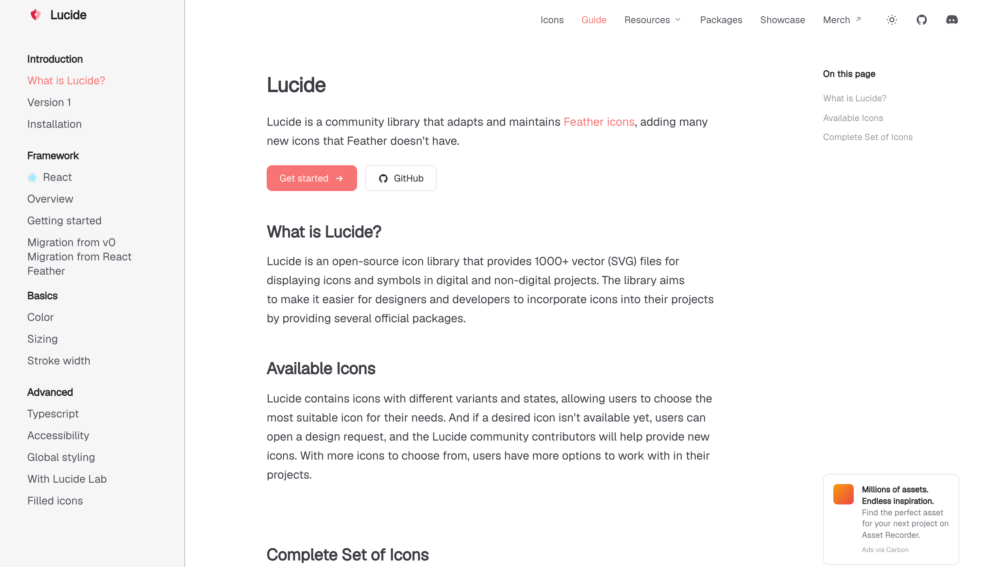
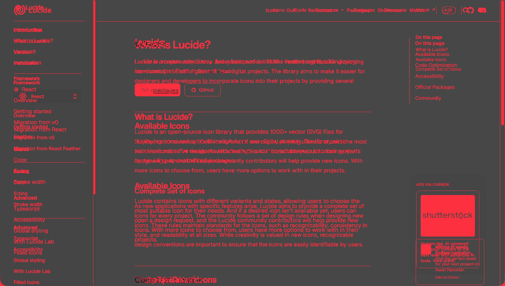
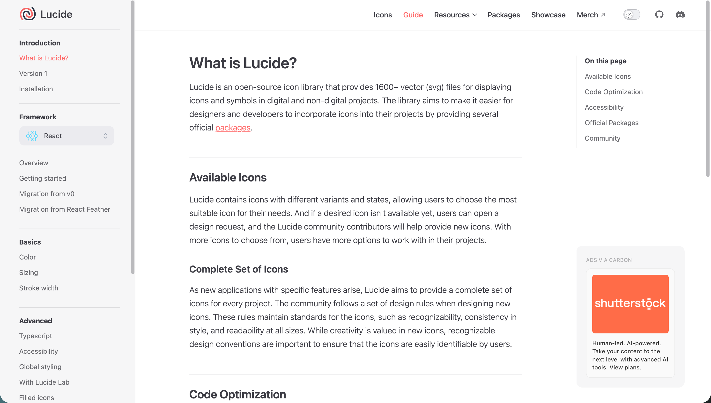
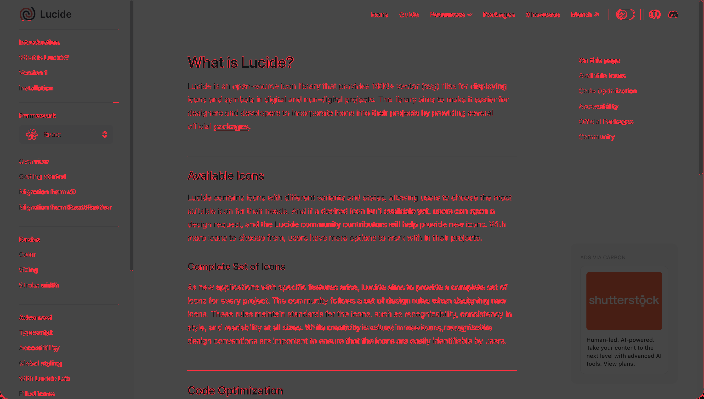

# Pixel-perfect-UI

[简体中文](README.md) | **English**

A frontend skill for screenshot reconstruction and visual correction of existing pages. It measures the reference, generates or patches working code, captures deterministic screenshots, produces pixel diffs, and keeps correcting the implementation instead of stopping at a failed validation report.

It supports HTML, React, Vue, and Svelte, together with CSS, Tailwind CSS, Less, and SCSS.

## Results

The following example uses the same Lucide page screenshot as the reference. **GLM 5.2** and **ChatGPT 5.6** each reconstructed it with Pixel-perfect-UI.

In the diff images, red regions indicate remaining pixel differences between the implementation and the reference.

### 1. Reference


### 2. GLM 5.2 Implementation



### 3. GLM 5.2 Diff



### 4. ChatGPT 5.6 Implementation



### 5. ChatGPT 5.6 Diff



In this example, GLM 5.2 reproduced the main page structure but retained visible differences in above-the-fold content, text, navigation, and component placement. ChatGPT 5.6 matched the layout, section boundaries, typography, and primary components more closely; its remaining differences are mainly font rendering, icons, and local pixel-level details.

> This example is provided only to demonstrate UI reconstruction. The Lucide name, page content, and related assets belong to their respective project owners.

## Core Capabilities

- Generate working frontend code from a full-page or cropped screenshot.
- Locate and patch the relevant page, component, and styles in an existing project.
- Measure the viewport, DPR, region bounds, typography, colors, and visual rules.
- Freeze fonts, images, transitions, and animations for deterministic browser captures.
- Produce a diff image and structured verification report, then keep correcting the result.
- Recover from incomplete measurements or raster-size mismatches instead of returning a terminal blocked state.

## Installation

Node.js and npm are required.

```bash
git clone https://github.com/xuexiswmz/Pixel-perfect-UI.git
cd Pixel-perfect-UI
```

Install into a Codex project:

```bash
node scripts/install-skill.js --ai codex --target /path/to/your-project --install-deps
```

Install into Cursor:

```bash
node scripts/install-skill.js --ai cursor --target /path/to/your-project --install-deps
```

Install into every supported AI tool directory:

```bash
node scripts/install-skill.js --ai all --target /path/to/your-project --install-deps
```

Codex installs the skill at `.codex/skills/pixel-perfect-ui/`; Cursor installs it at `.cursor/skills/pixel-perfect-ui/`.

## Usage

Attach the reference image and invoke the skill explicitly:

```text
Use $pixel-perfect-ui to reconstruct this screenshot with high visual fidelity.
Implement working code in the current project and preserve its existing stack. Then capture the page at the reference size, generate a diff, and continue correcting the implementation from the measured differences.
```

For an existing page:

```text
Use $pixel-perfect-ui to correct the current page from this reference image.
Locate the component that owns the affected region, change only the relevant code, and recapture and compare the page after every meaningful correction.
```

When known, also provide:

- The route or host component
- The reference viewport and DPR
- The target framework and styling system
- Fonts, icons, and image assets that must be reused

## Workflow

1. Inspect the reference and project, then lock the viewport, DPR, and target files.
2. Measure primary regions, text wrapping, spacing, borders, assets, and component morphology.
3. Generate a new page or apply the smallest relevant patch to the existing page.
4. Capture the implementation, generate a diff, and iterate until the code and verification artifacts are ready.

See [SKILL.md](SKILL.md) for the complete execution contract.

## Verification

```bash
npm install
npm run verify:all
```

To include browser-capture verification:

```bash
npm run verify:all:browser
```

## Project Structure

```text
pixel-perfect-ui/
├── SKILL.md              # Main skill workflow
├── scripts/              # Measurement, generation, capture, diff, and installation tools
├── references/           # Workflow documentation and data contracts
├── assets/               # Templates and test resources
├── agents/openai.yaml    # Codex display metadata and default prompt
└── docs/images/          # README comparison images
```

## License

This project is released under the [MIT License](LICENSE). You may use, copy, modify, merge, publish, and distribute it, provided that the original copyright notice and license text are retained.
